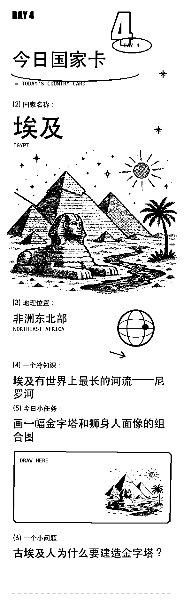

# AI-VOX3 呱呱 AI 热敏打印机

这是基于 [xiaozhi-esp32](https://github.com/78/xiaozhi-esp32) 修改的 AI-VOX3 固件。项目在原有语音聊天、唤醒、显示和 MCP 能力上，增加了 MY-638 80mm 热敏打印机支持，可通过语音打印文字、网络图片和内置小票模板。

> 当前仓库包含自定义 OTA 地址，建议保持为私有仓库。公开前请检查 `main/boards/ai-vox3/config.json`。

## 本版本主要改动

- 为 AI-VOX3 增加 UART2 热敏打印机驱动。
- 增加完整的打印机 MCP 工具，包括文字、Base64、URL、原始十六进制、自检和状态查询。
- 将四个 ESC/POS 模板嵌入固件，不依赖后端临时渲染。
- 支持 UTF-8/GBK 中文文字打印和 1A 标签模式测试。
- 对大图数据进行分块发送、完整性校验和打印浓度统一处理。
- 增加 Windows/macOS/Linux 可用的 Python 打印调试工具及图形界面。
- 使用自定义唤醒词“你好呱呱”，保留 AI-VOX3 AEC 与非 AEC 两种构建配置。

## 硬件配置

| 项目 | 当前配置 |
| --- | --- |
| 主控 | AI-VOX3 / ESP32-S3R8 / 16MB Flash |
| 打印机 | MY-638，80mm 热敏打印机 |
| 有效打印宽度 | 72mm / 576 dots |
| 串口 | UART2，8N1，无流控 |
| 波特率 | 9600 |
| AI-VOX3 TX | GPIO5，连接打印机 RX |
| AI-VOX3 RX | GPIO6，连接打印机 TX |

接线时必须共地。打印机建议使用稳定的 5-9V、至少 1.5A 电源；供电不足会导致打印变浅、竖纹或 ESP32 复位。

详细接线与故障排查见 [AI-VOX3 打印机集成说明](docs/ai-vox3-printer-integration.md)。

## 内置打印能力

固件注册了以下 MCP 工具：

| 工具 | 用途 |
| --- | --- |
| `self.printer.get_profile` | 查看型号、纸宽、波特率和串口状态 |
| `self.printer.print_text` | 打印中英文文字 |
| `self.printer.send_base64` | 接收 Base64 ESC/POS 数据 |
| `self.printer.print_url` | 下载并打印完整 ESC/POS 字节流 |
| `self.printer.print_lucky_ticket` | 打印高清“顶呱呱”小票 |
| `self.printer.print_country_card_egypt` | 打印“今日国家卡：埃及” |
| `self.printer.print_wealth_ticket` | 打印“先别慌，先发财”小票 |
| `self.printer.selftest` | 打印打印机内部自检页 |
| `self.printer.get_status` | 查询缺纸、开盖和在线状态 |
| `self.printer.send_hex` | 原样发送厂商指令，便于调试 |

可以直接说：

- “打印顶呱呱小票”
- “打印埃及国家卡”
- “打印发财小票”
- “打印机自检页”

## 小票预览

| 顶呱呱 | 今日国家卡 | 先别慌先发财 |
| --- | --- | --- |
|  |  |  |

## 编译与烧录

推荐环境：ESP-IDF 5.4.2、Python 3.12、ESP32-S3 工具链。新克隆后推荐直接使用发布脚本，它会应用 AI-VOX3 对应配置：

```bash
python scripts/release.py ai-vox3 --name ai-vox3
```

也可以手动构建：

```bash
idf.py set-target esp32s3
idf.py menuconfig
# 在 Board Type 中选择 AI-VOX3，保存后继续
idf.py build
idf.py -p COM6 flash
```

Windows 上的端口号可能不同，请在设备管理器中确认。若高速烧录中途断开，可以降低烧录速度：

```bash
idf.py -p COM6 -b 115200 flash
```

AEC 版本名称为 `ai-vox3-aec`。详细配置位于 `main/boards/ai-vox3/config.json`。

## 打印机调试工具

`638-printer` 目录提供图片转换、串口打印、状态检测和 GUI 工具：

```bash
cd 638-printer
python -m pip install -r requirements.txt
python printer_gui.py
```

使用说明见 [638-printer/README.md](638-printer/README.md)。

## 速度说明

9600 波特率稳定，但打印整页位图很慢。例如 136KB 的埃及国家卡，串口理论传输时间约 142 秒。浓度参数只影响加热和清晰度，不能解决串口传输瓶颈。

需要提速时，必须先用打印机配置工具把打印机本体改为 115200，再把 `main/boards/ai-vox3/config.h` 中的 `PRINTER_UART_BAUD_RATE` 同步改为 115200。两端波特率不一致会不出纸或打印乱码。

## 目录说明

```text
main/boards/ai-vox3/       AI-VOX3 板级实现、配置和内置小票
main/boards/common/        通用串口打印机驱动
638-printer/               PC 端图片转换与打印调试工具
docs/                      协议和本项目改造说明
hardware/                  AI-VOX3 硬件资料
guagua_audio/              自定义语音资源生成工具
```

## 致谢与许可

本项目基于 `78/xiaozhi-esp32` 二次开发，原项目及本仓库代码采用 MIT License。第三方硬件资料、字体、图片和音频资源仍受各自许可约束。
